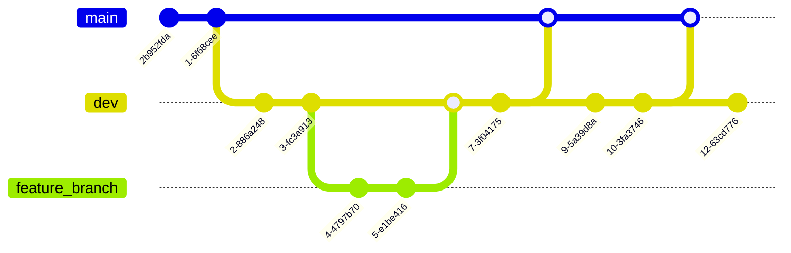

<!--

author:   Linda Zollitsch
email:    zollitsch@ub.uni-kiel.de
version:  0.1.0
license:  CC-BY
language: de
narrator: UK English Female

icon:     images/Logo_cau-norm-de-lilagrey-rgb-0720_2022.png

link: https://raw.githubusercontent.com/RDM4CAU/Intro-to-RDM/refs/heads/main/cau-style.css

comment:  This document provides a brief introduction to Markdown.

-->

# Start


Dieses Werk ist lizensiert unter CC-BY (https://creativecommons.org/licenses/by/4.0/)


# Markdown

hier können Basics für Markdown über einen Editor genutzt (und gecheated) werden

https://liascript.github.io/LiveEditor/?/edit/XARqDa105TNmxurx8ZWFVlhR


## Überschriften

Überschriften werden durch (#) gekennzeichnet und können bis zu 6 Stufen haben:


```
 # H1      
 ## H2     
 ### H3    
 #### H4   
 ##### H5  
 ###### H6  

```


## Text formatieren

alles, was nicht mit Markdown geht, kann mit html ausgezeichnet werden

https://web.stanford.edu/group/csp/cs21/htmlcheatsheet.pdf


### Schriftformatierung

{{1-2}}
************
```
kursiv: *italic*

fett: **bold**

kursiv und fett: ***bold and italic***

durchgestrichen: ~strike~
```
************

{{2}}
************

kursiv: *italic*

fett: **bold**

kursiv und fett: ***bold and italic***

durchgestrichen: ~strike~

************

### Listen

Einfache Aufzählungen mit * zu Beginn der Zeile

{{1-2}}
************

```
* Apfel

* Birne

* Kiwi

```
************

{{2-3}}
************

* Apfel

* Birne

* Kiwi

************

{{3-4}}
************

```
1. Apfel
2. Birne

    * Helene
1. Kiwi


```
************

{{4}}
************

1. Apfel
2. Birne

    * Helene
3. Kiwi

************


### Tabellen

| Spalte 1  | Spalte 2  | Spalte 3  |
| --------- | :-------: | --------: |
| Text 1    |   Text 1  |    Text 1 |
| Text 2    |   Text 2  |    Text 2 |


### Textfarbe

{{1-3}}
************
mit html - wird allerdings in Markdown nicht angezeigt (bei LiaScript jedoch schon)

```
<span style="color:red">
Dieser Text ist rot
</span>
```
************

{{2-3}}
************
<span style="color:red">
Dieser Text ist rot
</span>

************

{{3}}
************

oder alternativ für LiaScript auch so möglich

```
Text in dunkelblau <!-- style="color: darkblue" -->
```

Text in dunkelblau <!-- style="color: darkblue" -->

************

### Textgröße

```
Text in  <font size=7>groß</font> 

Text in etwas <font size=+3>größer</font>

Text in etwas <font size=-2>kleiner</font>
```

Text in  <font size=7>groß</font> 

Text in etwas <font size=+3>größer</font>

Text in etwas <font size=-2>kleiner</font>


## Einfügen von Inhalten

es können verschiedene Inhalte eingebunden werden.

### Einfügen von Bildern

{{1-2}}
************
```

```

************

{{2}}
************
```
Galerie: 
  
```
************


#### Bildgröße und Position

{{1-3}}
************

```

```
************

{{2-3}}
************


************

{{3-5}}
************
```
 <!-- width="150px" -->
```
************

{{4-5}}
************
 <!-- width="150px" -->

************

{{5}}
************
```
 <!-- width="350px" align="right" -->
```
************

{{6}}
************
 <!-- width="350px" align="right" -->

************

### Einfügen von Audio:

```
?[alt-text](url)
```

### Einfügen von Videos

```
!?[alt-text](path or url)
```

### Einfügen von Links

{{1-2}}
************

```
https://www.google.com

[inline-style link](https://www.google.com)

[inline-style link with title](https://www.google.com "Google's Homepage")

[relative reference to a repository file](../blob/master/LICENSE)

```
************

{{2}}
************

https://www.google.com

[inline-style link](https://www.google.com)

[inline-style link with title](https://www.google.com "Google's Homepage")

[relative reference to a repository file](../blob/master/LICENSE)

************

# GIT


**What is Version Management?**

- Keeping different variations of something in a comprehensible way.

  - Mostly files, in context of computers
  - Example:

    ```console
    File_v1.txt
    File_v2.txt
    ```

- Complex, if working with several people on the same thing at different locations

  - How to deal with editing conflicts?
  - How to deal with related files distributed in complex file hierarchies?
  - Manifold of creative approaches to file naming and version numbers
  - E-mail server as storage system

<div style="page-break-after: always;"></div>

### What is Git

- Warning: **Git is a complex beast**
- Open Source DVCS developed by Linus Torvalds for Linux-Kernel development
- Designed to facilitate:

  - Collaboration among diverse contributors worldwide.
  - Managing huge amounts of text files, notably source code files.
  - Managing changes spanning multiple files within complex directory structures.
  - Exploring (and discarding) different approaches of development.
  - Managing different variants and releases.


### Working with Git

**Working Online:**

- Sync with remote repositories over the internet.
- Maintain continuous synchronization with a central repository online.


### Branches and Tags

Branches and tags are both mechanisms for labeling and identifying specific points in the version history of a repository.

{{1}}
********************************************************************************

**Branches:**



- When you work with a git repository you always work in a *branch*.

  - Branches are identified by a name. The default branch is commonly named `main`.
  - Each commit on a branch is identified by a unique *commit hash*, e.g., `2b952fda`.
  - The branch name itself always points to the latest commit.

- To pursue uninterrupted development or test features without affecting collaborators, creating a new branch is advisable. Common are branches for:

  - A stable version (often the `main` branch).
  - Ongoing development (often called `dev`).
  - Introducing new features (typically named after the feature that is realised, e.g., `feature_branch`).

- Branches are identified by a name and reference a *commit*, with the branch name always pointing to the latest commit.

- To integrate changes from one branch into another, you can perform a *merge*, which involves incorporating all commits from the branch to be merged into the current branch (and resolving any conflicts that arise).

  > **Git commands:** [git branch](https://git-scm.com/docs/git-branch) and [git merge](https://git-scm.com/docs/git-merge)

********************************************************************************

<div style="page-break-after: always;"></div>

{{2}}
********************************************************************************

**Tags:**


- When you want to mark a specific commit for later reference, you can tag it.

  - For instance, you might tag a commit to signify a specific version of your work, such as `1.0.0`, `alpha` or `milestone1`.

- *Tags* have a name and always refer to the same *commit*, unless you change it yourself.

> **Git command:** [git tag](https://git-scm.com/docs/git-tag)

********************************************************************************

<div style="page-break-after: always;"></div>


# genutze Literatur / Vorlagen

https://github.com/adam-p/markdown-here/wiki/markdown-cheatsheet#headers

https://liascript.github.io/course/?https://raw.githubusercontent.com/liaScript/docs/master/README.md#1

Git-Präsentation von Bitta, Thilo und Thorge